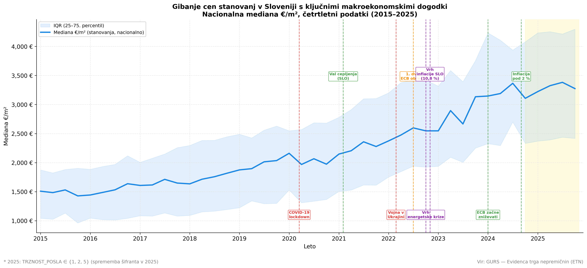
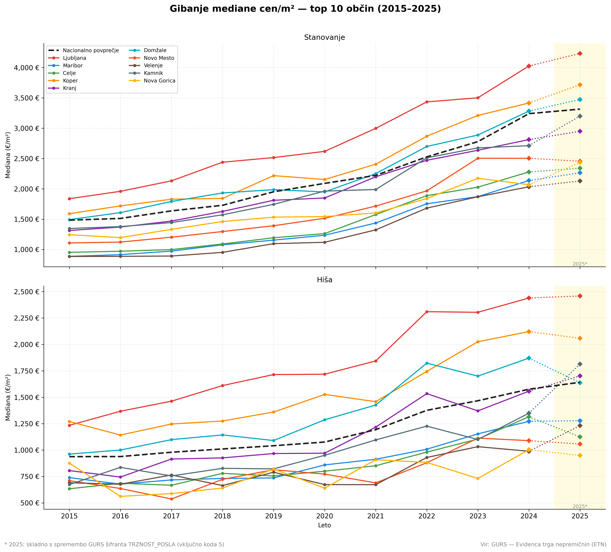
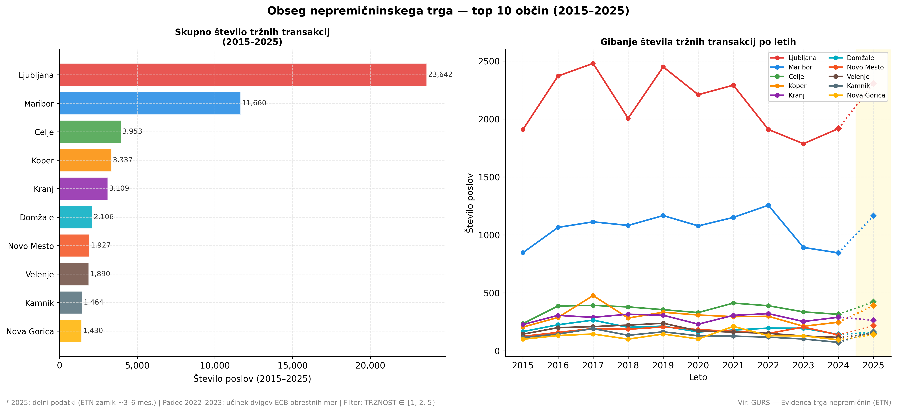
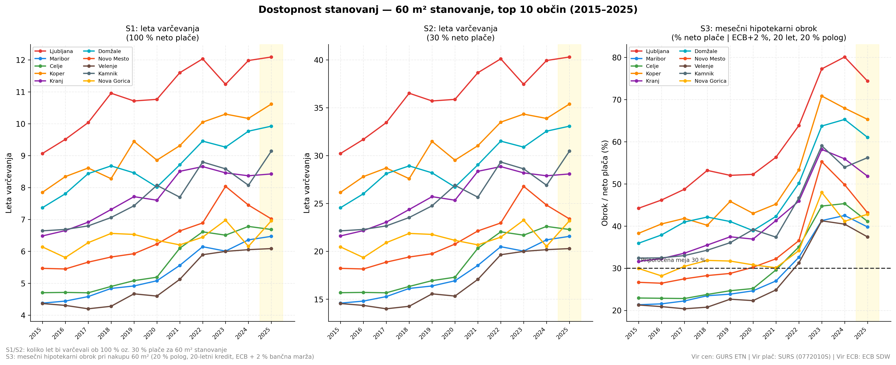
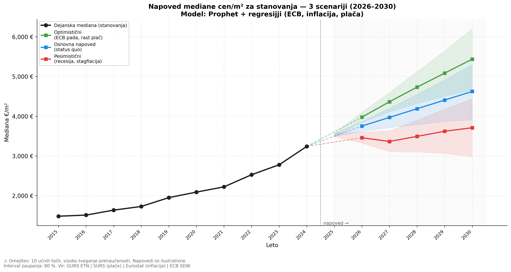

# Analiza slovenskega nepremičninskega trga (2015–2025)

**Skupina 06**
Povezava do aplikacije: https://nepremicnine-slovenija-2015-2025.streamlit.app/
Povezava do lokalne namestitve in zahtev za aplikacijo: https://github.com/karoliluka/PR2606/tree/main/real_estate_analysis

## 1. Uvod in problem

Cene nepremičnin v Sloveniji so v zadnjem desetletju doživele eno najburnejših obdobij v zgodovini trga. Med letoma 2015 in 2025 se je mediana cene stanovanj na kvadratni meter po celotni Sloveniji več kot podvojila, hkrati pa je trg prešel skozi več makroekonomskih šokov: pandemijo COVID-19, vojno v Ukrajini, energetsko krizo in najhitrejši cikel dvigov obrestnih mer ECB v zgodovini evroobmočja.

V tej projektni nalogi smo analizirali evidenco trga nepremičnin (ETN) Geodetske uprave RS za obdobje 2015–2025, s poudarkom na desetih slovenskih občinah z največjim obsegom poslov, osredotočili pa smo se na bivanjske nepremičnine (stanovanja in hiše). Iščemo odgovore na štiri ključna vprašanja: **kako** se je gibanje cen razlikovalo med občinami in tipi nepremičnin; **kdaj** so se zgodili največji preobrati in s katerimi makroekonomskimi dogodki sovpadajo; **kakšna je dostopnost** stanovanj za povprečnega prebivalca v različnih scenarijih financiranja; in **kaj lahko pričakujemo** v naslednjih petih letih. Cilj je prepoznati ključne vzorce v podatkih in jih kontekstualizirati z makroekonomskimi gibanji, ne pa zgolj opisati gibanja cen.

## 2. Podatki in metodologija

### 2.1 Viri podatkov

Glavni vir je **Evidenca trga nepremičnin (ETN)** Geodetske uprave RS. Iz baze smo uporabili **81.139 zapisov** o bivalnih nepremičninah v desetih največjih občinah po obsegu trga: *Ljubljana, Maribor, Celje, Koper, Kranj, Domžale, Novo mesto, Velenje, Kamnik in Nova Gorica*. Podatke smo dopolnili z viri **SURS** (plače, populacija), **Eurostat** (inflacija HICP) in **ECB SDW** (obrestne mere).

### 2.2 Ključni stolpci in izpeljane spremenljivke

Iz baze ETN smo uporabili naslednje stolpce:

| Stolpec | Pomen |
|---|---|
| `POGODBENA_CENA_ODSKODNINA` | Skupna pogodbena vrednost posla (€) |
| `POVRSINA_DELA_STAVBE` | Neto površina dela stavbe (m²) |
| `OBCINA`, `LETO_x` | Občina in leto sklenitve posla |
| `TRZNOST_POSLA` | Oznaka tržnosti posla (GURS šifrant) |
| `DEJANSKA_RABA_DELA_STAVBE` | GURS šifra rabe (npr. 1110001 = samostoječa hiša, 1122100 = stanovanje v večstanovanjski stavbi) |
| `DATUM_UVELJAVITVE` | Datum pravnomočnosti posla |

Iz teh smo izpeljali ključne spremenljivke: **`CENA_M2`** (`POGODBENA_CENA_ODSKODNINA / POVRSINA_DELA_STAVBE`) ako osnovno primerjalno metriko v vseh grafih, in **`TIP`** (klasifikacija na *Stanovanje* ali *Hiša* na podlagi GURS šifranata). Pri analizi smo se osredotočili predvsem na finančno-prostorske spremenljivke.

### 2.3 Predobdelava

Pri pripravi podatkov smo morali rešiti pomembno težavo: **GURS šifrant `TRZNOST_POSLA` se je v opazovanem obdobju večkrat spremenil**. V letih 2015–2019 je tržne posle označevala oznaka **1**, v letih 2020–2022 oznaka **2**, od leta 2025 pa oznaka **5**. Za konsistentno definicijo tržnega posla skozi celotno obdobje smo zato vključili vse tri oznake (`TRZNOST_POSLA ∈ {1, 2, 5}`), s čimer smo izključili netržne posle (darilne pogodbe, prodaje med sorodniki, prisilne prodaje). 

Dodatno smo z metodo **IQR (5.–95. percentil)** znotraj posamezne občine, tipa in leta odstranili ekstremne vrednosti zaradi napak v vnosu. Za napovedi smo uporabili **Prophet** s tremi eksogenimi spremenljivkami (obrestna mera ECB, inflacija HICP, povprečna neto plača). Vsa koda je na voljo v GitHub repozitoriju.

## 3. Cene v ogledalu makroekonomskih dogodkov

Slika 1 prikazuje gibanje nacionalne mediane cen stanovanj na kvadratni meter v obdobju 2015–2025, z označenimi ključnimi makroekonomskimi dogodki.

Med letoma 2015 in 2019 je rast cen sledila zmernemu, predvidljivemu trendu (~5–7 % letno), gnanemu z gospodarsko rastjo in nizkimi obrestnimi merami. **COVID-19 pandemija** je marca 2020 povzročila kratek upad poslov, ki pa mu je v drugi polovici leta sledilo izrazito pospeševanje rasti zaradi kombinacije nizkih obrestnih mer, povečane likvidnosti in spremenjenih bivanjskih preferenc.

Drugi prelom se je zgodil **julija 2022**, ko je ECB začela cikel dvigov obrestnih mer kot odgovor na inflacijo, ki je v Sloveniji oktobra 2022 dosegla vrhunec pri 10,8 %. Nominalne cene so se ohranile blizu vrha, vendar se je rast vidno upočasnila. V letu 2024 se je inflacija znižala pod 2 %, ECB pa je začela obresti postopno spuščati, kar je sovpadalo s ponovnim porastom števila poslov v zadnjih mesecih opazovanega obdobja.

**Glavna ugotovitev:** slovenske cene nepremičnin niso endogeno določene s ponudbo in povpraševanjem v Sloveniji — so neposreden odsev evropskih in svetovnih makroekonomskih ciklov.

## 4. Regionalne razlike: kdo si lahko privošči Ljubljano?

Slika 2 prikazuje gibanje mediane €/m² po desetih največjih občinah, ločeno za stanovanja in hiše.

**Trije cenovni nivoji.** Ljubljana je v celotnem obdobju daleč najdražja — leta 2024 je mediana cene stanovanja dosegla **4.026 €/m²**. Sledijo ji občine v ljubljanskem zaledju in na obali (Koper, Domžale, Kranj, Kamnik) z medianami med **2.712 in 3.416 €/m²**. V tretji skupini so cenovno dostopnejše občine (Novo mesto, Celje, Maribor, Nova Gorica in Velenje) z medianami med **2.034 in 2.503 €/m²**. Razpon med najdražjo (Ljubljana) in najcenejšo občino (Velenje) je leta 2024 znašal skoraj **2.000 €/m²**.

**Stanovanja in hiše se obnašajo drugače.** Pri stanovanjih je trend gladko naraščajoč, pri hišah pa so cene izrazito bolj volatilne. Razlog je v veliko manjšem vzorcu poslov s hišami (~20 %) in v njihovi raznolikosti — vsaka hiša je specifična glede lokacije, parcele in starosti.

**Najpomembnejša ugotovitev:** razlika med Ljubljano in najcenejšimi občinami se v opazovanem obdobju ni zmanjšala — nasprotno, v absolutnem smislu se je **več kot podvojila** z ~950 €/m² (2015) na ~2.000 €/m² (2024). Slovenski nepremičninski trg postaja vedno bolj geografsko razslojen.

## 5. Drugi del zgodbe: koliko se sploh kupuje?

Slika 3 prikazuje gibanje števila tržnih transakcij po desetih največjih občinah v obdobju 2015–2025.

**Ljubljana dominira tudi po številu poslov.** Skozi celotno opazovano obdobje je bilo v Ljubljani sklenjenih **23.642 tržnih poslov**, kar je več kot dvakrat toliko kot v Mariboru (11.660) in več kot v vseh ostalih osmih občinah skupaj.

**Regionalno različen odziv na dvige obresti ECB.** Najbolj zanimiv vzorec ni splošen padec, temveč **izrazito različen odziv občin** na zaostritev monetarnih pogojev po letu 2022. Ljubljana je doživela le zmeren upad — število tržnih poslov je s 1.910 (2022) padlo na 1.787 (2023, –6,4 %), nato pa se v letu 2024 že odbilo na 1.918 (skoraj enako kot leta 2022). Maribor pa je doživel veliko hujši udarec: število poslov je padlo s 1.256 (2022) na le 845 (2024), kar pomeni **upad za 32,7 % v dveh letih**. Razlog je verjetno v tem, da je Ljubljana z večjo diverzifikacijo povpraševanja in več finančno močnimi kupci bolj odporna na monetarne šoke kot manjši regionalni trgi.

Iz tega sledi naravno vprašanje: če cene rastejo in obroki rastejo, kakšna je dejanska dostopnost stanovanj za povprečnega Slovenca?

## 6. Dostopnost: koliko let do lastnega doma?

Slika 4 prikazuje tri scenarije za nakup 60 m² stanovanja v vseh desetih obravnavanih občinah.

**Scenarij 1 (100 % plače).** V zelo nerealnem primeru, kjer bi posameznik vso neto plačo namenil za varčevanje, bi leta 2024 za 60 m² stanovanje v Ljubljani potreboval **12 let**, v Kopru 10,3, v Mariboru pa 6,4. Številke so nerealistično optimistične, vendar služijo kot teoretična spodnja meja.

**Scenarij 2 (30 % plače).** Pri realističnem deležu prihranka, ki ga banke priporočajo (do tretjine neto plače), se ta čas potroji. Ljubljančan bi potreboval **skoraj 40 let varčevanja**. Seveda je to izračun za enega posameznika; v večini primerov bo stanovanje odplačano s pomočjo partnerja ali družine.

**Scenarij 3 (hipotekarni obrok).** Ključni kazalnik dostopnosti je mesečni obrok kredita kot delež neto plače (za 20-letni kredit s 20 % pologa in obrestno mero ECB + 2 %). Leta 2015 je obrok za stanovanje v Ljubljani odnesel okoli **44 % plače**, leta 2023 opazimo vrh pri **skoraj 80 %**, ko povprečna plača po bančnih kriterijih sploh ni več zadoščala za odobritev. **Glavni krivec za ta skok pa niso bile cene nepremičnin, temveč dvig obrestnih mer ECB**: brez njih bi obrok ostal pri zmernejših 55 %. V Mariboru, Celju in Velenje obrok vztraja okoli 40 %, kar potrjuje velike geografske razlike v dostopnosti. **Leto 2025 končno prinaša prve znake izboljšanja** zaradi nižanja obrestnih mer ECB — obrok v Ljubljani se je spustil na približno 75 %, kar dokazuje, da nepremičninski trg trenutno najbolj krojijo monetarni pogoji, ne pa same cene.

## 7. Pogled v prihodnost: Kam gremo do leta 2030?

Za napovedovanje gibanja cen stanovanj na kvadratni meter med letoma 2026 in 2030 smo uporabili naprednejši algoritem **Prophet**, ki poleg samega zgodovinskega trenda upošteva še zunanje (eksogene) regresorje: napovedi obrestnih mer ECB, stopnje inflacije in rasti neto plač. Ker je prihodnost makroekonomije negotova, smo simulirali tri različne scenarije razvoja dogodkov, ki jih prikazuje Slika 5.

**1. Osnovna napoved (status quo - modra črta):** Ta scenarij predvideva stabilno nadaljevanje trenutnih trendov – postopno, umirjeno nižanje obrestnih mer ECB ter zmerno gospodarsko in plačno rast. Model v tem primeru napoveduje stabilno, a upočasnjeno rast cen. Mediana cen stanovanj v Sloveniji bi se iz trenutnih dobrih 3.200 €/m² do leta 2030 povzpela na približno **4.600 €/m²**.

**2. Optimistični scenarij (hitro nižanje ECB obresti in rast plač - zelena črta):** Če se inflacija trajno ukroti, ECB pa agresivneje zniža obrestne mere, se bo kupna moč preko ugodnejših kreditov močno sprostila. Podatki modela kažejo, da bi takšen monetarni pospešek cene pognal strmo navzgor, saj bi mediana do leta 2030 prebila mejo **5.400 €/m²**. Za mlade kupce to paradoksalno pomeni, da bi cenejši krediti zaradi rasti cen hitro izničili začetni prihranek pri obroku.

**3. Pesimistični scenarij (recesija in stagflacija - rdeča črta):** V primeru ponovnih geopolitičnih šokov, rasti inflacije in posledično vnovičnega dviga obrestnih mer (ali globoke gospodarske recesije), bi nepremičninski trg zadel ob trdi zid. Model napoveduje, da bi v letih 2026 in 2027 prišlo do realnega in nominalnega upada cen (dno pri okoli **3.350 €/m²**), nato pa do stagnacije, kjer bi se trg do leta 2030 stabiliziral pri približno **3.700 €/m²**. Zaradi širokega intervala zaupanja (80 % osenčeno območje) je ta scenarij najbolj volatilen.

## 8. Zaključek

Analiza več kot 81.000 podatkovnih zapisov Evidence trga nepremičnin (ETN) med letoma 2015 in 2025 nam je omogočila jasen, s podatki podprt pogled na slovenski nepremičninski trg, s čimer smo odgovorili na zastavljena raziskovalna vprašanja:

*   **Monetarni pogoji krojijo trg:** Ključna ugotovitev analize je, da gibanje cen nepremičnin v Sloveniji ni izoliran lokalni pojav, temveč neposreden odsev makroekonomskih odločitev Evropske centralne banke. 

*   **Geografska razslojenost se poglablja:** Razkorak med Ljubljano (kjer so cene presegle 4.000 €/m²) in regionalnimi središči (npr. Velenje ali Maribor) se je v zadnjem desetletju v absolutnem smislu podvojil. Ljubljana zaradi kapitalsko močnejših kupcev ostaja izjemno odporna na šoke, medtem ko so manjši trgi veliko bolj ranljivi.

*   **Dostopnost je dosegla kritično točko:** Stanovanjska dostopnost za povprečnega zaposlenega posameznika je v Ljubljani brez pomoči zunanjih virov (partner, družina) postala teoretično skoraj nemogoča, saj bi hipotekarni obrok leta 2023 odnesel skoraj 80 % neto plače. Leto 2025 sicer nakazuje rahlo izboljšanje, a izračuni modela Prophet do leta 2030 opozarjajo, da bodo cene ob stabilnem makroekonomskem okolju še naprej rasle.

### Člani skupine
- Aleks Ašanin
- Luka Karoli
- Edis Mizić
- Aljaž Smole
- Matej Zaletelj
